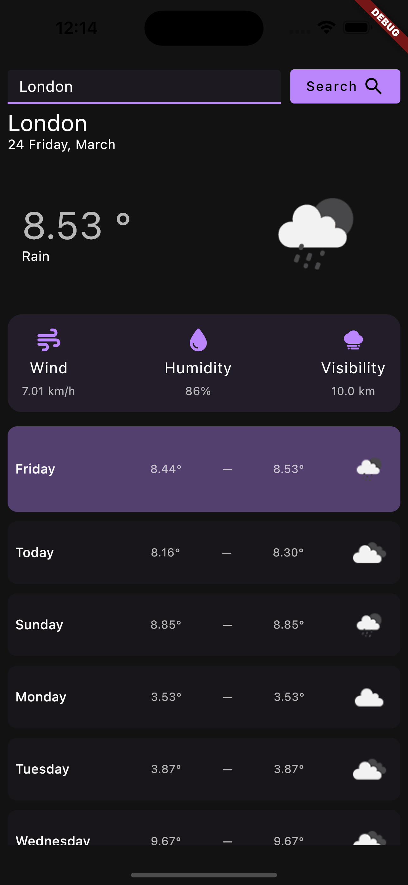
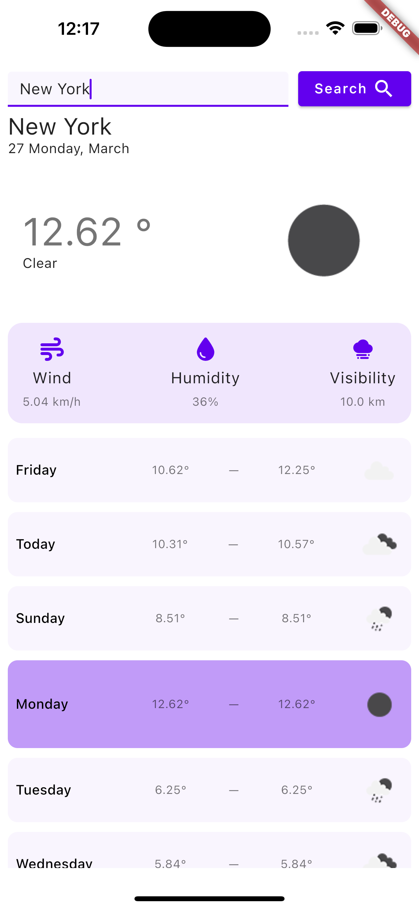
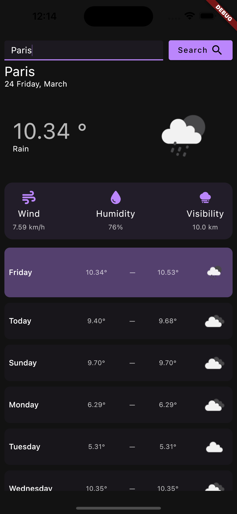

# weather_week

A simple weather app that lets you search weather forecast upto 5 days by city name.


# Screenshots

<div class="row">
</img>
</img>
</img>
</div>

# How to use

## Step 1:

Clone this repository

```
git clone git@github.com:sharmashashi/weather_week.git
```

## Step 2:

Goto the project root and get the dependencies

```
cd weather_week && flutter pub get
```

## Step 3:

Open .env file and replace `open_weather_api_key` value with your original [Open Weather API Key](https://api.openweathermap.org/)

## Step 4:

Run the project

```
flutter run
```

# Folder Structure

```

```
